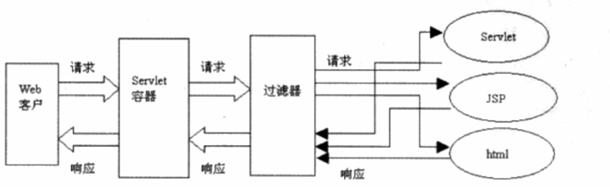

###### 什么是Java过滤器
 首先Java的过滤器是servlet中定义的，它能够在请求传递给servlet之前对ServletRequest和ServletResponse进行
 检查和修改，起到过滤的作用
 

springBoot实现的过滤器
Spring Boot 中的过滤器是基于 Servlet 过滤器。第一步，定义过滤器的类，该类必须继承 Filter 接口。
自定义过滤器
```

public class myFilter implements Filter {

    @Override
    public void init(FilterConfig filterConfig) throws ServletException {
        
    }
    @Override
    public void doFilter(ServletRequest request, ServletResponse response, FilterChain chain)
    throws IOException, servletException {
        HttpServletRequest requst = (HttpServletRequest) request;
        System.out.printLn("我的过滤器" + request.getRequestURI)
        chain.doFilter(request, response);
    
    }
    @Override
    public void destory () {
    
    }

}

```
如何注册

```
使用@Component和order注解

@Order(Ordered.LOWEST_PRECEDENCE -1)
@Component
public class myFilter implements Filter {

    @Override
    public void init(FilterConfig filterConfig) throws ServletException {
        
    }
    @Override
    public void doFilter(ServletRequest request, ServletResponse response, FilterChain chain)
    throws IOException, servletException {
        HttpServletRequest requst = (HttpServletRequest) request;
        System.out.printLn("我的过滤器" + request.getRequestURI)
        chain.doFilter(request, response);
    
    }
    @Override
    public void destory () {
    
    }

}

```
使用webFilter注册
```

使用@Component和order注解

@webFilter(urlPattern = "/api/*")
public class myFilter implements Filter {

    @Override
    public void init(FilterConfig filterConfig) throws ServletException {
        
    }
    @Override
    public void doFilter(ServletRequest request, ServletResponse response, FilterChain chain)
    throws IOException, servletException {
        HttpServletRequest requst = (HttpServletRequest) request;
        System.out.printLn("我的过滤器" + request.getRequestURI)
        chain.doFilter(request, response);
    
    }
    @Override
    public void destory () {
    
    }

}

```
@webFilter是servlet的注解 springboot能够支持该注解通过@ServletComponentScan 注解，能够扫描并注册到 Servlet 容器中
还需要@ServletComponentScan 注解
```
@ServletComponentScan
@SpringBootApplication
public class SpringbootlearnApplication {
 
	public static void main(String[] args) {
		SpringApplication.run(SpringbootlearnApplication.class, args);
	}
}
```
@WebFilter 方式，可以支持 UrlPatterns 的设置，但是不支持 Order 的设置。

https://www.concretepage.com/spring-boot/spring-boot-filter